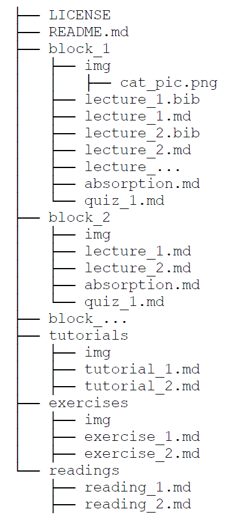

## General features

* GitHub is used to store and version-track all the teaching material and to render it as an online website
* For each Learning Kit, all the material for the Theory Lectures, the Hands-on exercise and the Tutorial should be written using Markdown. Documentation and syntax of Markdown available here [markdown]
* A standard folder structure is used to store the course material on GitHub, as per image below

## Description of the folder structure

* LICENSE: It contains a text file with the complete licensing information. For the choice and use of licenses, refer to [licenses]
* README.md: It is a markdown file including all the course information, collected according to these guidelines 
* img: it is a sub-folder created for each lecture and containing the original files of all the images used in the lecture
* lecture_x.bib: it is a file containing the bibliography of the lecture, as exported from the referencing tool (e.g. Mendeley or Zotero)
* lecture_x.md: it contains the text to be shown in the lecture (titles, content). An example for this is available here [example]
* absorption.md:
* quiz_x.md: it contains the quuestions of the quiz for lecture x
* reading_x.md: it contains the references to the reading material for lecture x, compiled using an official referencing style

[markdown]: https://commonmark.org/
[licenses]: https://creativecommons.org/share-your-work/
[example]: https://github.com/ClimateCompatibleGrowth/course_test/blob/main/block_1/lecture_1.md